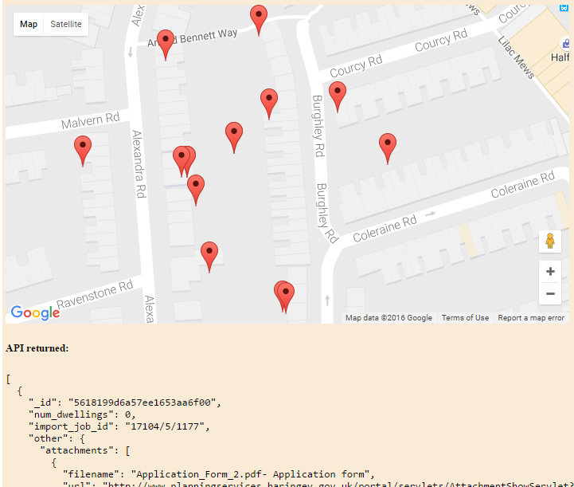
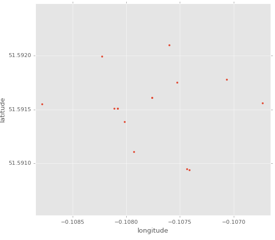
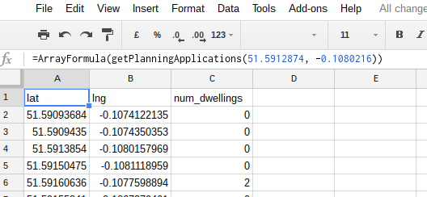

# Land Insight Planning API demos
Remember, to use the [Land Insight Planning API](http://www.landinsight.io/api) you will need to request an API key.   


If you just want some examples of how to make calls to the API in a specific programming language, check out the [Code Example Tool](http://docs.landinsight.apiary.io/#reference/planning-applications/list/get?console=1) in the apiary docs.  


Below we describe and explain how to setup the various demos in this repository.


## Putting pins on Google Maps in the browser

Anyone with web-development experience should find it fairly easy to plot planning data with Google Maps.  You don't even need to run a localhost server!   



The full code for this demo is in `googlemaps.html`, below we give a slightly simplified version.   

We start with the [Add a Marker demo](https://developers.google.com/maps/documentation/javascript/adding-a-google-map) provided by Google, and then add in a little extra code for querying the Land Insight API.  Before going further, you will need to follow the instructions in that demo to get yourself an API key for the Google Maps service (this is obviously unrelated to your Land Insight API key).   

Right, now you have a Google API Key, ceate a blank `.html` file and copy in the code from the Google demo, setting your Google API key (as inidicated by the Google sample).  Then open the file in your browser and check it works - including panning/zooming of the map.

Next, simply replace the `initMap` function with the following:

```javascript
function initMap() {
  let theMap = new google.maps.Map(document.getElementById('map'), {
    zoom: 16,
    center: {lat: 51.5912874, lng: 0.1080217},
  });
  fetch('https://api.landinsight.io/v_beta/planning/planning-applications?radius=100&limit=15&location=1080217%2C51.5912874/',
        {headers: {'X-Api-Key': 'YOUR_LAND_INSIGHT_API_KEY_HERE'}})
  .then(resp => resp.json())
  .then(json => {
      let locations = json.map(x => ({
          lat: x.location.coordinates[1],
          lng: x.location.coordinates[0]
      }));
      locations.map(x => new google.maps.Marker({
        position: x,
        map: theMap
      }));
  });
}
```

Note that the above is written using nice modern JavaScript features (ES6), so it may not work in older browsers.

That's it!


## Plotting points with matplotlib in python

For this demo, you need python, with `matplotlib` installed. 



The full code for this demo is in `matplotlib_demo.py`.   

We make the request as follows:

```python
request = Request(r'https://api.landinsight.io/v_beta/planning/'
                  r'planning-applications?radius=100&limit=15&'
                  r'location=-0.1080217%2C51.5912874/', headers={
                      'Content-Type': r'application/json',
                      'X-Api-Key': r'YOUR_API_KEY_HERE'
                   })
response_body = urlopen(request).read()
```

Then we parse the json, and extract some data to plot:

```python
data = json.loads(response_body)
locations = np.empty((len(data), 2))
for ii, record in enumerate(data):
    locations[ii,:] = record['location']['coordinates']
```

And this is how we plot it:
```python
plt.plot(locations[:, 0], locations[:, 1], '.')
```

## Viewing data in a table using Google Drive spreadsheets

If you are comfortable working with spreadsheets, but not programming this may be of interest to you.  (Although only very basic functionality is currently provided in the script below, so you may need to ask someone to flesh it out a little if you are uncomfortable programming yourself).



Create a new spreadsheet in Google Drive. In the menu, go to `Tools > Script editor...`.  Then paste in the following code, supplying you private API key in the location indicated,  and press save:

```javascript
function getPlanningApplications(lat, lng) {
  var data = UrlFetchApp.fetch('https://api.landinsight.io/v_beta/planning/planning-applications?radius=100&limit=15&location=' + lng + '%2C' + lat + '/',
                               {headers: {'X-Api-Key': 'YOUR_API_KEY_HERE'}}).getContentText();
  var locations = JSON.parse(data).map(function(x){
    return [x.location.coordinates[1], x.location.coordinates[0], x.num_dwellings];
  });
  return [["lat", "lng", "num_dwellings"]].concat(locations);
}
```

Next, go back to the spreadsheet itself, and type the following in one of the cells:  

```
=ArrayFormula(getPlanningApplications(51.5912874, -0.1080216))
```
